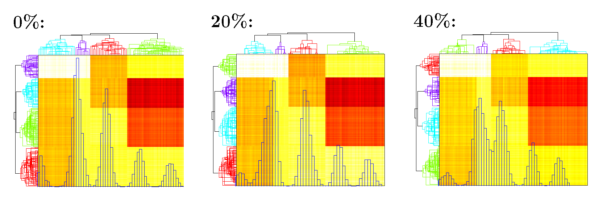
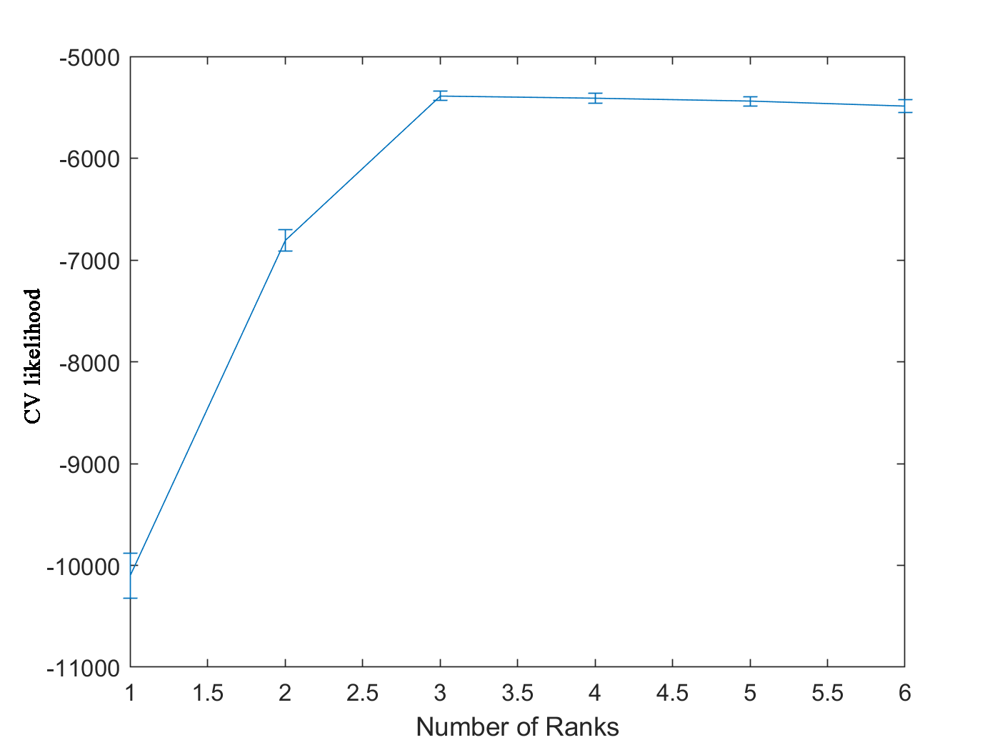

```{r setup, include=FALSE}
knitr::opts_chunk$set(echo = TRUE,
                      warning = FALSE,
                      message = FALSE,
                      fig.height = 5,
                      fig.width = 10)

library(knitr)

```
<br><br>

# 1. Zero Inflated Poisson Regression 

Let's introduce the zero inflated Poisson regression where the logit true zero probability is negatively associated with log Poisson expectation. 

Let the response variable be $Y=(y_1,y_2,\ldots,y_n)^\top$ following a zero-inflated Poisson distribution:

$$
		Y_i\sim \begin{cases}
	0, & \text{with prob} = p_i\\
	Poisson(m_i \lambda_i), & \text{with prob} = 1-p_i
	\end{cases}
$$
where $m=(m_1,m_2,\cdots,m_n)^\top$ is the known scaling vector and <span style="color: #EB6864;"> takes the value of constant 1 in most cases</span>. Let $X$ be an $n$ by $p$ design matrix, where column vector $X_i$ denotes the i\textsuperscript{th} row of $X$; $\beta =(b_1, b_2,\ldots, b_{p})^\top$ is the coefficient vector to be estimated.

With the aforementioned relationship between $p_i$ and $\lambda_i$, the model satisfies:
$$
		\ln \operatorname{E}(Y_i/m_i|X_i)=\ln(\lambda_i)=X_i^\top\beta \qquad \text{and}\qquad 	\text{logit}(p_i)=-\tau\ln(\lambda_i).
$$
<br>

### 1.1 Simulation Data
```{r engine='octave',eval=FALSE}
  % sample size
n = 5000;
  % variable x1
x1 = randn(n,1);
  % variable x2
x2 = randn(n,1);
  % beta_0 = 1.5, beta_1 = 1, beta_2 = -2
lam = exp(x1 - 2*x2 + 1.5);
  % generate the Poisson part, m = 1
y = poissrnd(lam, n, 1);
  % tau = 0.75
tau = 0.75; 
  % true zero prabability p
p = 1./(1+lam.^tau);
Z = binornd(1, p, n ,1);
  % replace some values with true zeros
y(logical(Z)) = 0;
```
<br>

### 1.2 Model Estimation
We use function <span style="color: #EB6864;font-weight:bold">EMzeropoisson_mat()</span> to build the zero inflated Poisson regression. 
```{r engine='octave',eval=FALSE}
  % run the regression
res = EMzeropoisson_mat([y x1 x2]);

Initializing ...
Start maximizing ...
This is 2 th iteration, Frobenius norm diff = 0.19006. 
This is 3 th iteration, Frobenius norm diff = 0.0417531. 
This is 4 th iteration, Frobenius norm diff = 0.00745735. 
This is 5 th iteration, Frobenius norm diff = 0.00143856. 
This is 6 th iteration, Frobenius norm diff = 0.000269189. 
This is 7 th iteration, Frobenius norm diff = 0.000249212. 
This is 8 th iteration, Frobenius norm diff = 0.000100414. 
This is 9 th iteration, Frobenius norm diff = 1.75117e-05. 

  % get fitted tau
fittedtau = res(end,1);

fittedtau =

    0.7424

  % get fitted intercept
fittedintercept = res(end,2);

fittedintercept =

    1.4947

  % get fitted beta
fittedbeta = res(end,3:end);

fittedbeta =

    1.0001   -2.0002
```
We get the estimated intercept $1.50$, $\beta_1 = 1.00$, $\beta_2 = -2.00$, $\tau = 0.74$, which are the parameters we used to generate the data. 

**Usage of** &nbsp;<span style="color: #EB6864;font-weight:bold">EMzeropoisson_mat()</span>: <br>

<span style="color: #228B22;letter-spacing: 0.05em;">
&nbsp;&nbsp;fittedbeta = EMzeropoisson_mat([y x]) <br><br>
&nbsp;&nbsp;fittedbeta = EMzeropoisson_mat([y x], tau, 'display', false, ...) <br><br>
--&nbsp;data: First y then x.<br>
--&nbsp;tau (0.1): Initial tau to fit. Will be overwritten by 'initial'.<br>
--&nbsp;'initial' ([]): Initial [tau beta].<br>
--&nbsp;'initialtau' ('iteration'): Choose the initial value of tau at the beginning of EM iteration.<br>
&nbsp;&nbsp;&nbsp;&nbsp;&nbsp;&nbsp;'stable': estimate tau from fitted beta in last round;<br>
&nbsp;&nbsp;&nbsp;&nbsp;&nbsp;&nbsp;'initial': always use the initially assigned tau in 'tau' or 'initial';<br>
&nbsp;&nbsp;&nbsp;&nbsp;&nbsp;&nbsp;&nbsp;&nbsp;&nbsp;&nbsp;Use the default tau = 0.1 if 'initial' is empty.<br>
&nbsp;&nbsp;&nbsp;&nbsp;&nbsp;&nbsp;'iteration': use fitted tau in last round.<br>
--&nbsp;'tol' (1e-4): Percentage of l2 norm change of [tau beta].<br>
--&nbsp;'maxiter' (100): Max iteration.<br>
--&nbsp;'Madj' (false): Whether adjust for relative library size M.<br>
--&nbsp;'m' ([]): Relative library size M.<br>
--&nbsp;'display' (true): Display the fitting procedure.<br>
--&nbsp;'intercept' (true): Whether the model contains an intercept.<br>
</span>

Result contains the fitted results in each row. The last row shows
the final result. First column is tau, second column is intercept (if the
model has intercept), other columns are fitted coefficients. 
<br><br>

# 2. Zero Inflated Poisson Factor Analysis
In microbiome studies, the absolute sequencing read counts are summarized in a matrix $A \in \mathbb{N}_0^{n\times m}$, where $n$ is the sample size and $m$ is the number of taxa. Let $A_{ij}$ represents the read count of taxon $j$ of individual $i$ $(i=1,\cdots,n;\, j=1,\cdots,m)$. Let $N = (N_1,N_2,\cdots,N_n)^\top$ a be vector of the relative library sizes where:
$$
	N_i =\sum_{j=1}^m A_{ij}\bigg/\operatorname{median}\left( \sum_{j=1}^m A_{1j},\; \sum_{j=1}^m A_{2j},\; \cdots,\; \sum_{j=1}^m A_{nj} \right).
$$
Since excessive zeros may come from true absence or undetected presence of taxa, a mixed distribution is proper to describe $A_{ij}$. It is reasonable to assume each read count $A_{ij}$ follows a zero-inflated Poisson (ZIP) distribution:
$$
	A_{ij}\sim
	\begin{cases}
	0, & \text{with prob }= p_{ij}\\
	Poisson(N_i\lambda_{ij}), & \text{with prob }= 1-p_{ij}
	\end{cases}
$$
where $p_{ij}\; (0\le p_{ij} \le 1)$ is the unknown parameter of the Bernoulli distribution that describes the occurrence of true zeros; $\lambda_{ij}\; (\lambda>0)$ is the unknown parameter of the normalized Poisson part, and $N_i \lambda_{ij}$ is the Poisson rate adjusted by the subject-specific relative library size $N_{i}$. Then let $P = \operatorname{logit}(p_{ij}) \in \mathbb{R}^{n\times m}$ and  $\Lambda = \ln( \lambda_{ij})\in \mathbb{R}^{n\times m}$ be the corresponding natural parameter matrices to map parameters $p_{ij}$, $\lambda_{ij}$ to the real line.

To link the negative relationship between true zero probability $p_{ij}$ and Poisson rate $\lambda_{ij}$, we propose to use a positive shape parameter $\tau$ to build the logistic link by modeling $P=-\tau \Lambda$ (i.e.,  $\operatorname{logit}(p_{ij})=-\tau \ln(\lambda_{ij})$).

To encourage dimension reduction, we assume matrix $\Lambda \in \mathbb{R}^{n\times m}$ has a low rank structure $\Lambda = UV^\top$ with rank $K<\min(m, n)$, where $U\in \mathbb{R}^{n\times K}$ is the score matrix; $V \in \mathbb{R}^{m\times K}$ is the loading matrix. Then the proposed ZIPFA model with rank $K$ is given by:
$$
		\begin{cases}
A_{ij}\sim \text{ZIP distribution}\\
\operatorname{logit}(p_{ij})=-\tau \ln(\lambda_{ij}) \\
%\quad \left(p_{ij}=\frac{1}{1+\lambda_{ij}^\tau}\right)\\
\ln (\lambda_{ij})=u_{i1}v_{j1}+u_{i2}v_{j2}+\cdots+u_{iK}v_{jK}
\end{cases}
$$
where $u_{ij}$, $v_{ij}$ are elements of $U$, $V$. Here, $u_{ij}$ represents the j\textsuperscript{th} factor score for the i\textsuperscript{th} individual, and
$v_{ij}$ is the i\textsuperscript{th} taxon loading on j\textsuperscript{th} factor.

<br>

### 2.1 Simulation Data

We generate rank-3 synthetic NGS data of $200$ samples ($n=200$) and $100$ taxa ($m=100$) according to the model assumption. The Poisson logarithmic rate matrix $\Lambda=UV^\top$, where $U\in \mathbb{R}^{m\times 3}$ is a left singular vector matrix, and $V\in \mathbb{R}^{n\times 3}$ is a right singular vector matrix. We consider three different clustering patterns in the samples as depicted in $U$. To generate $U$, we create a 200-by-3 matrix $U$ such that:
\begin{alignat*}{2}
	&U(36:80,1)=2.0,&\qquad &U(81:140,1)=1.7\\
	&U(1:35,2)=1.8,&\qquad &U(36:80,2)=0.9\\
	&U(36:200,3)=1.7&&
\end{alignat*}
with all the other entries being 0, and then jitter all the entries
by adding random numbers generated from $N(0, 0.06^2$). Similarly, To generate $V$, we create a 100-by-3 matrix $V$ such that:
\begin{alignat*}{2}
	&V(61:100,1)=1.7& &\\
	&V(36:60,2)=1.7,&\qquad &V(61:100,2)=1.0\\
	&V(1:25,3)=1.7,&\qquad& V(26:100,3)=0.9
\end{alignat*}
with all the other entries being 0, and then jitter all the entries
by adding random numbers generated from $N(0, 0.05^2)$. The three columns of $U$ and $V$ are plotted in the columns of Figure 1(a) and the true $\ln(\lambda)$ matrix is plotted in Figure 1(b). Each row in $U$ corresponds to one sample and each row in $V$ indicates one taxon profile. In Figure 1(c),(d), we applied complete linkage hierarchical clustering to $U$, $V$. It is clear that both taxa and samples could be clustered into $4$ groups. 

We generate matrix $A^\circ$ that $A_{ij}^\circ \sim Poisson(N_i\lambda_{ij})$ where the scaling parameter $N_i$ is set to be $1$. Also we need  true zero probability $p_{ij}$ to generate inflated zeros:

$$
\operatorname{logit}(p_{ij})=-\tau \ln(\lambda_{ij}) \quad (p_{ij}=\frac{1}{1+\lambda_{ij}^\tau})
$$
	
We adjust the total percentage of excessive zeros by setting different $\tau$ values. Once $p_{ij}$ is generated, our simulated NGS data matrix $A$ can be obtained by replacing $A^\circ_{ij}$ with $0$ with the probability of $p_{ij}$. 

<center>
<br>
Figure 1. Plots of simulation parameters. (a) True left singular vectors $U$ and true right singular vector $V$, indicating taxon clusters. (b) Heatmap of true $\ln(\lambda)$ matrix. (c)(d) The factor values for each sample/taxa. They could be clustered into 4 groups.
</center>

```{r engine='octave',eval=FALSE}
rng(1)
  % Matrix U, V
u = [[0*ones(35,1); 2*ones(45,1); 1.7*ones(60,1);0*ones(60,1)]...
    [1.8*ones(35,1);0.9*ones(45,1); 0*ones(120,1)]...
    [0*ones(35,1);1.7*ones(165,1)]];
vt = [[0.0*ones(1,30) 0*ones(1,30) 1.7*ones(1,40)];...
    [0*ones(1,35) 1.7*ones(1,25) 1*ones(1,40)];...
    [1.7*ones(1,25) 0.9*ones(1,50) 0.9*ones(1,25)]];
u = normrnd(0,0.06,200,3)+u;
vt = normrnd(0,0.05,3,100)+vt;
  % Lambda matrix
a = u * vt;
  % lambda_{ij}
lambda = exp(a);
  % Poisson Part
X = poissrnd(lambda,200,100);
  % tau value
tau = 0.616;
  % add true zeros
P = 1./(1+lambda.^tau);
Z = binornd(1,P,200,100);
X(logical(Z)) = 0;

```
<br>

### 2.2 Model Estimation with Specified Rank
We use function <span style="color: #EB6864;font-weight:bold">ZIPFA()</span> to conduct the zero inflated Poisson factor analysis.
```{r engine='octave',eval=FALSE}
  % run the model (rank = 3)
[Ufit, Vfit, itr, fittedtau, likelihood]= ZIPFA(X,3,'Madj',true);

 ****************** 
 Round 1 
 ******************
Start maximizing ...
This is 2 th iteration, Frobenius norm diff = 0.144376. 
This is 3 th iteration, Frobenius norm diff = 0.0130052. 
This is 4 th iteration, Frobenius norm diff = 0.00159143. 
This is 5 th iteration, Frobenius norm diff = 0.000272557. 
This is 6 th iteration, Frobenius norm diff = 4.52615e-05. 
Start maximizing ...
This is 2 th iteration, Frobenius norm diff = 0.316534. 
This is 3 th iteration, Frobenius norm diff = 0.0136768. 
This is 4 th iteration, Frobenius norm diff = 0.00205909. 
This is 5 th iteration, Frobenius norm diff = 0.000218763. 
This is 6 th iteration, Frobenius norm diff = 2.62362e-05. 
   (1,1)     -5.6447e+04

(skip some lines)

 ****************** 
 Round 4 
 ******************
Start maximizing ...
This is 2 th iteration, Frobenius norm diff = 0.0519199. 
This is 3 th iteration, Frobenius norm diff = 0.00202233. 
This is 4 th iteration, Frobenius norm diff = 0.000392653. 
This is 5 th iteration, Frobenius norm diff = 7.75216e-05. 
Start maximizing ...
This is 2 th iteration, Frobenius norm diff = 0.158463. 
This is 3 th iteration, Frobenius norm diff = 0.0047452. 
This is 4 th iteration, Frobenius norm diff = 0.000416554. 
This is 5 th iteration, Frobenius norm diff = 4.65384e-05. 
   1.0e+04 *

   (1,1)      -5.6447
   (1,2)      -5.2973
   (1,3)      -5.2890
   (1,4)      -5.2881

Max Ln likelihood diff = 0.01594 % 

  % fitted U, V
fittedU = Ufit{itr};
fittedV = Vfit{itr};

  % iteration number, fitted tau, likelihood in each iteration
>> itr
itr =
     4

>> fittedtau
fittedtau =
    0.6165

>> likelihood
likelihood =
   1.0e+04 *

   (1,1)      -5.6447
   (1,2)      -5.2973
   (1,3)      -5.2890
   (1,4)      -5.2881
```
The algorithm converges in 4 iterations with fitted $\tau = 0.62$. The likelihood increases during the fitting procedure. The heatmap of $U V^\top$ is in Figure 2. 

**Usage of** &nbsp;<span style="color: #EB6864;font-weight:bold">ZIPFA()</span>: <br>

<span style="color: #228B22;letter-spacing: 0.05em;" >
&nbsp;&nbsp;[Ufit,Vfit] = ZIPFA(X, k)<br><br>
&nbsp;&nbsp;[Ufit,Vfit] = ZIPFA(X, k, tau, 'cut', 1, 'display', false, ...)<br><br>
&nbsp;&nbsp;[Ufit,Vfit,itr,finaltau,Likelihood] = ZIPFA(X, k)<br><br>
&nbsp;&nbsp;[Ufit,Vfit,itr,finaltau,Likelihood,CVLikelihood] = ZIPFA(X, k, 'missing', missingmat)<br><br>
--&nbsp;X: The matrix to be decomposed.<br>
--&nbsp;k: The number of factors.<br>
--&nbsp;tau (0.1): The initial guess for tau.<br>
--&nbsp;'cut' (0.8): Whether to delete columns that has more than 100('cut')% zeros. 'Cut' = 1, if no filtering.<br>
--&nbsp;'tolLnlikelihood' (5e-4): The max percentage of log likelihood differences in two iterations.<br>
--&nbsp;'iter' (20): Max iterations.<br>
--&nbsp;'tol' (1e-4): Percentage of l2 norm change of [tau beta] in ZIP regression.<br>
--&nbsp;'maxiter' (100): Max iterations in ZIP regression.<br>
--&nbsp;'initialtau' ('iteration'): Choose the initial value of tau at the beginning of EM iteration in ZIP regression.<br>
&nbsp;&nbsp;&nbsp;&nbsp;&nbsp;&nbsp;'stable': estimate tau from fitted beta in last round;<br>
&nbsp;&nbsp;&nbsp;&nbsp;&nbsp;&nbsp;'initial': always use the initially assigned tau in 'tau' or 'initial';<br>
&nbsp;&nbsp;&nbsp;&nbsp;&nbsp;&nbsp;&nbsp;&nbsp;Use the default tau = 0.1 if 'initial' is empty.<br>
&nbsp;&nbsp;&nbsp;&nbsp;&nbsp;&nbsp;'iteration': use fitted tau in last round.<br>
--&nbsp;'Madj' (true): Whether adjust for relative library size M.<br>
--&nbsp;'display' (true): Display the fitting procedure.<br>
--&nbsp;'missing' ([]): T/F matrix. If 'missing' is not empty, then CVLikelihood is likelihood of X with missing = T.<br>
--&nbsp;'rept' ([]): Which fold is in cross validation. If rept is empty, then do not save result in this function.
</span>

Result contains the fitted U, V, iteration number, model total likelihood. 

<center>
<br>
Figure 2. Heatmap of $\widehat U\widehat V^\top$ under different percentage of inflated zeros. Blue histogram shows the distribution of fitted $\widehat U\widehat V^\top$; Phylogenetic tree on the top and left shows clustering of taxa and samples.
</center>
<br>

### 2.3 Cross Validation to Choose Rank
We use function <span style="color: #EB6864;font-weight:bold">cv_ZIPFA()</span> to conduct the zero inflated Poisson factor analysis.

```{r engine='octave',eval=FALSE}
  % do cross validation with parallel computing (rank = 1 to 6)
[cvsample,CVlikelihood]=cv_ZIPFA(X,1:6,10,'Madj',false,'parallel',true,'display',false);

>> CVlikelihood
CVlikelihood =
   1.0e+04 *

   -1.0287   -0.6793   -0.5317   -0.5344   -0.5388   -0.5424
   -1.0197   -0.6900   -0.5349   -0.5358   -0.5408   -0.5444
   -0.9696   -0.6647   -0.5375   -0.5401   -0.5413   -0.5467
   -0.9850   -0.6799   -0.5353   -0.5372   -0.5397   -0.5449
   -1.0299   -0.6749   -0.5445   -0.5477   -0.5517   -0.5566
   -1.0214   -0.6972   -0.5371   -0.5398   -0.5414   -0.5451
   -1.0065   -0.6922   -0.5475   -0.5494   -0.5511   -0.5634
   -1.0336   -0.6848   -0.5390   -0.5410   -0.5447   -0.5474
   -0.9873   -0.6726   -0.5384   -0.5396   -0.5437   -0.5458
   -1.0184   -0.6700   -0.5411   -0.5431   -0.5463   -0.5515

>> median(CVlikelihood)
ans =
   1.0e+04 *

   -1.0191   -0.6796   -0.5380   -0.5400   -0.5426   -0.5462
```
Each row in 'CVlikelihood' represents the CV likelihood of one fold and each column is for specified rank (from 1 to 6). The median CV likelihood reaches its maximum value when rank equals to 3 in Figure 3, which is the rank we used to generate the simulation data. 


**Usage of** &nbsp;<span style="color: #EB6864;font-weight:bold">cv_ZIPFA()</span>: <br>

<span style="color: #228B22;letter-spacing: 0.05em;" >
&nbsp;&nbsp;[cvsample,Allres] = cv_ZIPFA (X, k)<br><br>
&nbsp;&nbsp;[cvsample,Allres] = cv_ZIPFA (X, k, fold, tau)<br><br>
&nbsp;&nbsp;[cvsample,Allres] = cv_ZIPFA (X, k, 'cut', 1)<br><br>
&nbsp;&nbsp;[cvsample,Allres] = cv_ZIPFA (X, k, 'display', false, 'savemat', true, ...)<br><br>
--&nbsp;X: The matrix to be decomposed.<br>
--&nbsp;k: The number of factors. It can be a vector.<br>
--&nbsp;fold (10): The number of folds used in cross validation.<br>
--&nbsp;tau (0.1): The initial guess for tau.<br>
--&nbsp;'cut' (0.8): Whether to delete columns that has more than 100('cut')% zeros. 'Cut' = 1, if no filtering.<br>
--&nbsp;'tolLnlikelihood' (5e-4): The max percentage of log likelihood differences in two iterations.<br>
--&nbsp;'iter' (20): Max iterations.<br>
--&nbsp;'tol' (1e-4): Percentage of l2 norm change of [tau beta] in ZIP regression.<br>
--&nbsp;'maxiter' (100): Max iterations in ZIP regression.<br>
--&nbsp;'initialtau' ('iteration'): Choose the initial value of tau at the beginning of EM iteration in ZIP regression.<br>
&nbsp;&nbsp;&nbsp;&nbsp;&nbsp;&nbsp;'stable': estimate tau from fitted beta in last round;<br>
&nbsp;&nbsp;&nbsp;&nbsp;&nbsp;&nbsp;'initial': always use the initially assigned tau in 'tau' or 'initial';<br>
&nbsp;&nbsp;&nbsp;&nbsp;&nbsp;&nbsp;&nbsp;&nbsp;&nbsp;&nbsp;Use the default tau = 0.1 if 'initial' is empty.<br>
&nbsp;&nbsp;&nbsp;&nbsp;&nbsp;&nbsp;'iteration': use fitted tau in last round.<br>
--&nbsp;'Madj' (true): Whether adjust for relative library size M.<br>
--&nbsp;'display' (true): Display the fitting procedure. Info in ZIPFA will not be shown in 'Parallel' mode even 'Display' is true.<br>
--&nbsp;'savemat' (false): Whether to save ZIPFA results in all factor numbers and each <br>
--&nbsp;'parallel' (true): Use parallel toolbox to accelerate.
</span>

<center>
<br>
Figure 3. CV likelihood vs. number of ranks
</center>

The variable 'cvsample' in workspace is the assignment of each fold in the cross validation. <span style="color: #EB6864;font-weight:bold">cv_ZIPFA()</span> generates 'cvsample' before it fits the model if there is no variable called 'cvsample' in the workspace. 

You can also assign your own assignment of each fold like this: 
```{r engine='octave',eval=FALSE}
  % create 'cvsample' for 10 folds
cvsample = repmat(1:10, 200*100/10,1);
cvsample = randsample(cvsample(:), 200*100);
cvsample = reshape(cvsample, 200, 100);

>> [~,CVlikelihood7]=cv_ZIPFA(X,7,10,'Madj',false,'display',false,'parallel',false);
Use existing cvsample!
```
The function will prompt that we are using the exsting 'cvsample'.


