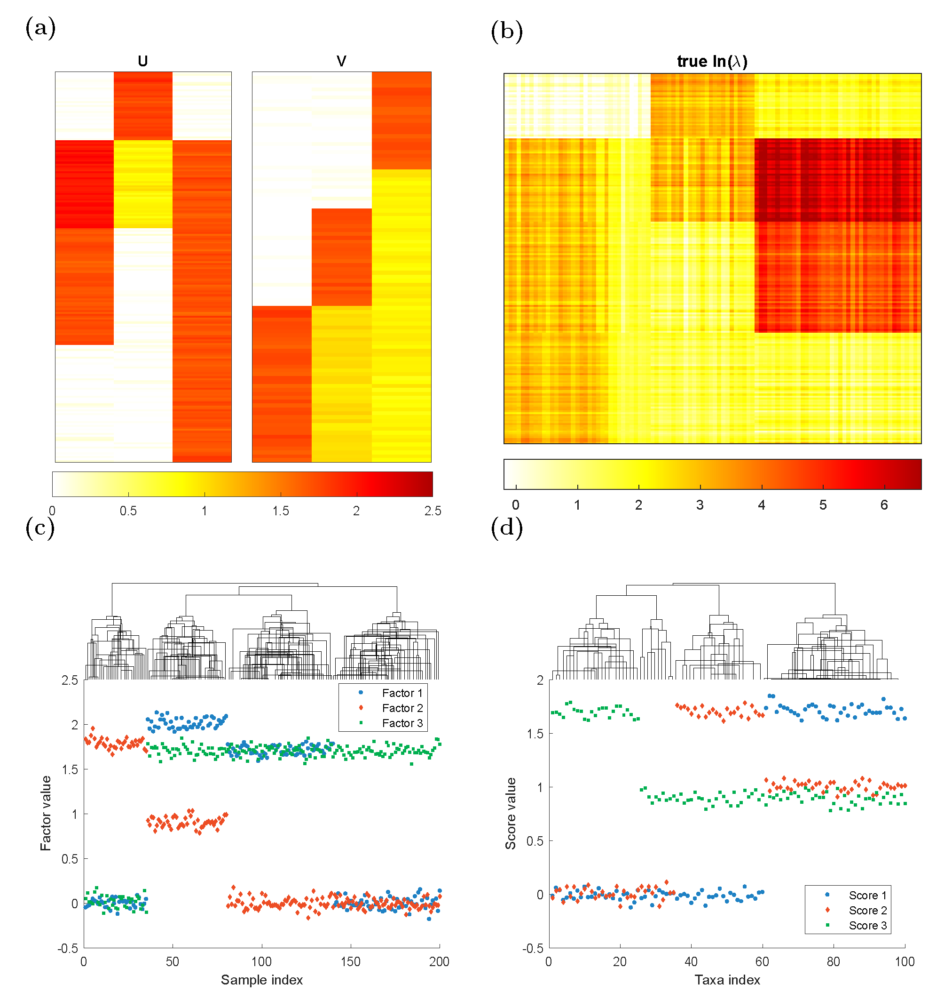
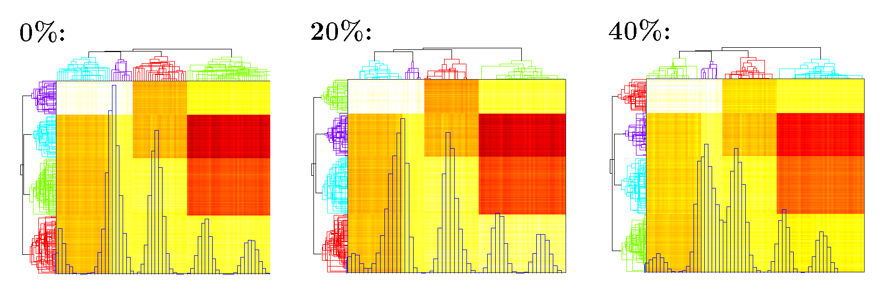
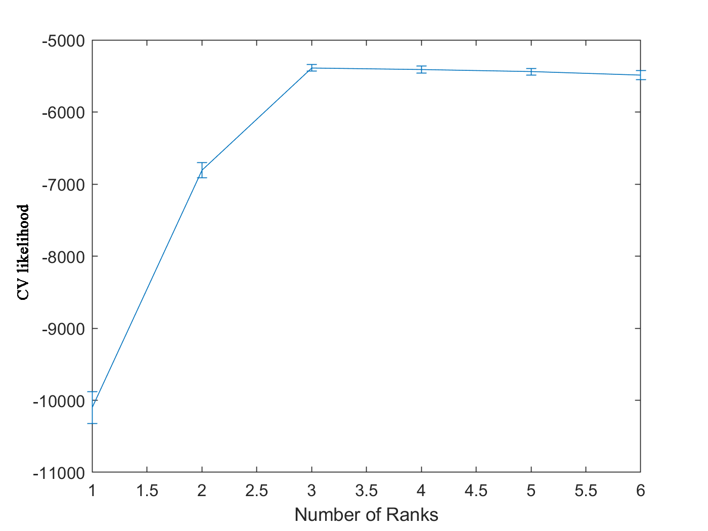

```{r setup, include=FALSE}
knitr::opts_chunk$set(echo = TRUE,
                      warning = FALSE,
                      message = TRUE,
                      fig.height = 5,
                      fig.width = 10)

library(knitr)

```
<br><br>

# 0. Install Package 'ZIPFA'
You need to install package [optimx](https://cran.r-project.org/web/packages/optimx/index.html), [trustOptim](https://cran.r-project.org/web/packages/trustOptim/index.html) before installing [ZIPFA](https://cran.rstudio.com/web/packages/ZIPFA/index.html).
```{r eval=FALSE}
install.packages('optimx')
install.packages('trustOptim')
install.packages('ZIPFA')
library('Matrix')
library('parallel')
library('doParallel')
library('foreach')
library('optimx')
library('trustOptim')
library('ZIPFA')
```
```{r echo=FALSE, message=FALSE}
library('Matrix')
library('parallel')
library('doParallel')
library('foreach')
library('optimx')
library('trustOptim')
library('ZIPFA')
```

<br><br>

# 1. Zero Inflated Poisson Regression 

Let's introduce the zero inflated Poisson regression where the logit true zero probability is negatively associated with log Poisson expectation. 

Let the response variable be $Y=(y_1,y_2,\ldots,y_n)^\top$ following a zero-inflated Poisson distribution:

$$
		Y_i\sim \begin{cases}
	0, & \text{with prob} = p_i\\
	Poisson(m_i \lambda_i), & \text{with prob} = 1-p_i
	\end{cases}
$$
where $m=(m_1,m_2,\cdots,m_n)^\top$ is the known scaling vector and <span style="color: #EB6864;"> takes the value of constant 1 in most cases</span>. Let $X$ be an $n$ by $p$ design matrix, where column vector $X_i$ denotes the i\textsuperscript{th} row of $X$; $\beta =(b_1, b_2,\ldots, b_{p})^\top$ is the coefficient vector to be estimated.

With the aforementioned relationship between $p_i$ and $\lambda_i$, the model satisfies:
$$
		\ln \operatorname{E}(Y_i/m_i|X_i)=\ln(\lambda_i)=X_i^\top\beta \qquad \text{and}\qquad 	\text{logit}(p_i)=-\tau\ln(\lambda_i).
$$
<br>

### 1.1 Simulation Data
```{r}
  # sample size
n <- 5000
  # variable x1
x1 <- rnorm(n)
  # variable x2
x2 <- rnorm(n)
  # beta_0 = 1.5, beta_1 = 1, beta_2 = -2
lam <- exp(x1 - 2*x2 + 1.5)
  # generate the Poisson part, m = 1
y <- rpois(n, lam)
  # tau = 0.75
tau <- 0.75
  # true zero prabability p
p <- 1./(1+lam^tau)
Z <- rbinom(n, 1, p)
  # replace some values with true zeros
y[as.logical(Z)] <- 0
```
<br>

### 1.2 Model Estimation
We use function <span style="color: #EB6864;font-weight:bold">EMzeropoisson_mat()</span> to build the zero inflated Poisson regression.
```{r}
  # run the regression
res <- EMzeropoisson_mat(matrix(c(y,x1,x2),ncol=3), Madj = FALSE, intercept = TRUE)

  # get fitted tau
fittedtau <- res[nrow(res),1]
fittedtau

  # get fitted intercept
fittedintercept <- res[nrow(res),2]
fittedintercept

  # get fitted beta
fittedbeta <- res[nrow(res),-(1:2)]
fittedbeta
```
We get the estimated intercept `r format(fittedintercept,digit=4)`, $\beta_1 =$ `r format(fittedbeta[1],digit=4)`, $\beta_2 =$ `r format(fittedbeta[2],digit=4)`, $\tau =$ `r format(fittedtau,digit=4)`, which are the parameters we used to generate the data.


**Usage of** &nbsp;<span style="color: #EB6864;font-weight:bold">EMzeropoisson_mat()</span>: <br>

<span style="color: #228B22;letter-spacing: 0.05em;">
&nbsp;&nbsp;fittedbeta <- EMzeropoisson_mat(data, tau = 0.1, initial = NULL, initialtau = 'iteration', tol = 1e-4, maxiter = 100, Madj = FALSE, m = NULL, display = TRUE, intercept = TRUE)<br><br>
--&nbsp;data: A matrix with the first columns is y and the rest columns are x.<br>
--&nbsp;tau (0.1): Initial tau value to fit. Will be overwritten by the first value in initial argument.<br>
--&nbsp;'initial' (NULL): A list of initial values for the fitting. c(tau beta).<br>
--&nbsp;'initialtau' ('iteration'): A character specifying the way to choose the initial value of tau at the beginning of EM iteration. <br>
&nbsp;&nbsp;&nbsp;&nbsp;&nbsp;&nbsp;'stable': estimate tau from fitted beta in last round;<br>
&nbsp;&nbsp;&nbsp;&nbsp;&nbsp;&nbsp;'initial': always use the initially assigned tau in 'tau' or 'initial';<br>
&nbsp;&nbsp;&nbsp;&nbsp;&nbsp;&nbsp;&nbsp;&nbsp;&nbsp;&nbsp;Use the default tau = 0.1 if 'initial' is empty.<br>
&nbsp;&nbsp;&nbsp;&nbsp;&nbsp;&nbsp;'iteration': use fitted tau in last round.<br>
--&nbsp;'tol' (1e-4): Percentage of l2 norm change of [tau beta].<br>
--&nbsp;'maxiter' (100): Max iteration number.<br>
--&nbsp;'Madj' (FALSE): If TRUE then adjust for relative library size M.<br>
--&nbsp;'m' (NULL): A vector containing relative library size M.<br>
--&nbsp;'display' (TRUE): If TRUE display the fitting procedure.<br>
--&nbsp;'intercept' (TRUE): If TRUE then the model contains an intercept.<br>
</span>

The function turns a matrix. Each row is fitted value in each iteration. The last row the final result. The first column is fitted $\tau$. If intercept is TRUE, then the second column is the intercept, and the rest columns are other coefficients. If intercept is FALSE, the rest columns are other coefficients.
<br><br>

# 2. Zero Inflated Poisson Factor Analysis
In microbiome studies, the absolute sequencing read counts are summarized in a matrix $A \in \mathbb{N}_0^{n\times m}$, where $n$ is the sample size and $m$ is the number of taxa. Let $A_{ij}$ represents the read count of taxon $j$ of individual $i$ $(i=1,\cdots,n;\, j=1,\cdots,m)$. Let $N = (N_1,N_2,\cdots,N_n)^\top$ a be vector of the relative library sizes where:
$$
	N_i =\sum_{j=1}^m A_{ij}\bigg/\operatorname{median}\left( \sum_{j=1}^m A_{1j},\; \sum_{j=1}^m A_{2j},\; \cdots,\; \sum_{j=1}^m A_{nj} \right).
$$
Since excessive zeros may come from true absence or undetected presence of taxa, a mixed distribution is proper to describe $A_{ij}$. It is reasonable to assume each read count $A_{ij}$ follows a zero-inflated Poisson (ZIP) distribution:
$$
	A_{ij}\sim
	\begin{cases}
	0, & \text{with prob }= p_{ij}\\
	Poisson(N_i\lambda_{ij}), & \text{with prob }= 1-p_{ij}
	\end{cases}
$$
where $p_{ij}\; (0\le p_{ij} \le 1)$ is the unknown parameter of the Bernoulli distribution that describes the occurrence of true zeros; $\lambda_{ij}\; (\lambda>0)$ is the unknown parameter of the normalized Poisson part, and $N_i \lambda_{ij}$ is the Poisson rate adjusted by the subject-specific relative library size $N_{i}$. Then let $P = \operatorname{logit}(p_{ij}) \in \mathbb{R}^{n\times m}$ and  $\Lambda = \ln( \lambda_{ij})\in \mathbb{R}^{n\times m}$ be the corresponding natural parameter matrices to map parameters $p_{ij}$, $\lambda_{ij}$ to the real line.

To link the negative relationship between true zero probability $p_{ij}$ and Poisson rate $\lambda_{ij}$, we propose to use a positive shape parameter $\tau$ to build the logistic link by modeling $P=-\tau \Lambda$ (i.e.,  $\operatorname{logit}(p_{ij})=-\tau \ln(\lambda_{ij})$).

To encourage dimension reduction, we assume matrix $\Lambda \in \mathbb{R}^{n\times m}$ has a low rank structure $\Lambda = UV^\top$ with rank $K<\min(m, n)$, where $U\in \mathbb{R}^{n\times K}$ is the score matrix; $V \in \mathbb{R}^{m\times K}$ is the loading matrix. Then the proposed ZIPFA model with rank $K$ is given by:
$$
		\begin{cases}
A_{ij}\sim \text{ZIP distribution}\\
\operatorname{logit}(p_{ij})=-\tau \ln(\lambda_{ij}) \\
%\quad \left(p_{ij}=\frac{1}{1+\lambda_{ij}^\tau}\right)\\
\ln (\lambda_{ij})=u_{i1}v_{j1}+u_{i2}v_{j2}+\cdots+u_{iK}v_{jK}
\end{cases}
$$
where $u_{ij}$, $v_{ij}$ are elements of $U$, $V$. Here, $u_{ij}$ represents the j\textsuperscript{th} factor score for the i\textsuperscript{th} individual, and
$v_{ij}$ is the i\textsuperscript{th} taxon loading on j\textsuperscript{th} factor.

<br>

### 2.1 Simulation Data

We generate rank-3 synthetic NGS data of $200$ samples ($n=200$) and $100$ taxa ($m=100$) according to the model assumption. The Poisson logarithmic rate matrix $\Lambda=UV^\top$, where $U\in \mathbb{R}^{m\times 3}$ is a left singular vector matrix, and $V\in \mathbb{R}^{n\times 3}$ is a right singular vector matrix. We consider three different clustering patterns in the samples as depicted in $U$. To generate $U$, we create a 200-by-3 matrix $U$ such that:
\begin{alignat*}{2}
	&U(36:80,1)=2.0,&\qquad &U(81:140,1)=1.7\\
	&U(1:35,2)=1.8,&\qquad &U(36:80,2)=0.9\\
	&U(36:200,3)=1.7&&
\end{alignat*}
with all the other entries being 0, and then jitter all the entries
by adding random numbers generated from $N(0, 0.06^2$). Similarly, To generate $V$, we create a 100-by-3 matrix $V$ such that:
\begin{alignat*}{2}
	&V(61:100,1)=1.7& &\\
	&V(36:60,2)=1.7,&\qquad &V(61:100,2)=1.0\\
	&V(1:25,3)=1.7,&\qquad& V(26:100,3)=0.9
\end{alignat*}
with all the other entries being 0, and then jitter all the entries
by adding random numbers generated from $N(0, 0.05^2)$. The three columns of $U$ and $V$ are plotted in the columns of Figure 1(a) and the true $\ln(\lambda)$ matrix is plotted in Figure 1(b). Each row in $U$ corresponds to one sample and each row in $V$ indicates one taxon profile. In Figure 1(c),(d), we applied complete linkage hierarchical clustering to $U$, $V$. It is clear that both taxa and samples could be clustered into $4$ groups. 

We generate matrix $A^\circ$ that $A_{ij}^\circ \sim Poisson(N_i\lambda_{ij})$ where the scaling parameter $N_i$ is set to be $1$. Also we need  true zero probability $p_{ij}$ to generate inflated zeros:

$$
\operatorname{logit}(p_{ij})=-\tau \ln(\lambda_{ij}) \quad (p_{ij}=\frac{1}{1+\lambda_{ij}^\tau})
$$
	
We adjust the total percentage of excessive zeros by setting different $\tau$ values. Once $p_{ij}$ is generated, our simulated NGS data matrix $A$ can be obtained by replacing $A^\circ_{ij}$ with $0$ with the probability of $p_{ij}$. 

<center>
<br>
Figure 1. Plots of simulation parameters. (a) True left singular vectors $U$ and true right singular vector $V$, indicating taxon clusters. (b) Heatmap of true $\ln(\lambda)$ matrix. (c)(d) The factor values for each sample/taxa. They could be clustered into 4 groups.
</center>

```{r}
set.seed(1)
  # Matrix U, V
u <- c(rep(0,35), rep(2,45), rep(1.7, 60), rep(0,60), rep(1.8,35), rep(0.9,45), rep(0,120), rep(0,35), rep(1.7,165))
u <- matrix(u, byrow = F, ncol = 3)
vt <- c(rep(0,30), rep(0,30), rep(1.7,40), rep(0,35), rep(1.7,25), rep(1,40), rep(1.7,25), rep(0.9,50), rep(0.9,25))
vt <- matrix(vt, byrow = T, nrow = 3)
u <- rnorm(600,0,0.06)+u
vt <- rnorm(300,0,0.05)+vt
  # Lambda matrix
a <- u %*% vt
  # lambda_{ij}
lambda <- exp(a)
  # Poisson Part
X <- rpois(20000, lambda)
X <- matrix(X, byrow = F, nrow = 200)
  # tau value
tau <- 0.616
  # add true zeros
P <- 1./(1+lambda^tau)
Z <- rbinom(20000,size = 1,P)
X[as.logical(Z)] <- 0
```
<br>

### 2.2 Model Estimation with Specified Rank
We use function <span style="color: #EB6864;font-weight:bold">ZIPFA()</span> to conduct the zero inflated Poisson factor analysis.
```{r}
  # run the model (rank = 3)
res <- ZIPFA(X, k = 3, Madj = F, display = F)

  # fitted U, V
fittedU <- res$Ufit[[res$itr]]
fittedV <- res$Vfit[[res$itr]]

  # iteration number, fitted tau, likelihood in each iteration
itr <- res$itr
itr

fittedtau <- res$tau
fittedtau

likelihood <- res$Likelihood
likelihood
```
The algorithm converges in 4 iterations with fitted $\tau =$ `r format(fittedtau,digit=4)`. The likelihood increases during the fitting procedure. The heatmap of $U V^\top$ is in Figure 2. 


**Usage of** &nbsp;<span style="color: #EB6864;font-weight:bold">ZIPFA()</span>: <br>

<span style="color: #228B22;letter-spacing: 0.05em;" >
&nbsp;&nbsp;res <- ZIPFA(X, k, tau = 0.1, cut = 0.8, tolLnlikelihood = 5e-4, iter = 20, tol = 1e-4, maxiter = 100, initialtau = 'iteration', Madj = TRUE, display = TRUE, missing = NULL)<br><br>
--&nbsp;X: The matrix to be decomposed.<br>
--&nbsp;k: The number of factors.<br>
--&nbsp;tau (0.1): Initial tau value to fit. Will be overwritten by the first value in initial argument.<br>
--&nbsp;'cut' (0.8): To delete columns that has more than 100('Cut')% zeros. Cut = 1, if no filtering.<br>
--&nbsp;'tolLnlikelihood' (5e-4): The max percentage of log likelihood differences in two iterations.<br>
--&nbsp;'iter' (20): Max iteration number in the zero inflated poisson regression.<br>
--&nbsp;'tol' (1e-4): Percentage of l2 norm change of [tau beta] in ZIP regression.<br>
--&nbsp;'maxiter' (100): Max iterations in ZIP regression.<br>
--&nbsp;'initialtau' ('iteration'): A character specifying the way to choose the initial value of tau at the beginning of EM iteration. <br>
&nbsp;&nbsp;&nbsp;&nbsp;&nbsp;&nbsp;'stable': estimate tau from fitted beta in last round;<br>
&nbsp;&nbsp;&nbsp;&nbsp;&nbsp;&nbsp;'initial': always use the initially assigned tau in 'tau' or 'initial';<br>
&nbsp;&nbsp;&nbsp;&nbsp;&nbsp;&nbsp;&nbsp;&nbsp;Use the default tau = 0.1 if 'initial' is empty.<br>
&nbsp;&nbsp;&nbsp;&nbsp;&nbsp;&nbsp;'iteration': use fitted tau in last round.<br>
--&nbsp;'Madj' (TRUE): If TRUE then adjust for relative library size M.<br>
--&nbsp;'display' (TRUE): If TRUE display the fitting procedure.<br>
--&nbsp;'missing' (NULL): T/F matrix. If 'missing' is not empty, then CVLikelihood is likelihood of X with missing = T.<br>
</span>

Result contains the fitted U (a list containing fitted U matrix in each iteration and the last one is the final fit), V (a list containing fitted U matrix in each iteration and the last one is the final fit), iteration number, model total likelihood. 

<center>
<br>
Figure 2. Heatmap of $\widehat U\widehat V^\top$ under different percentage of inflated zeros. Blue histogram shows the distribution of fitted $\widehat U\widehat V^\top$; Phylogenetic tree on the top and left shows clustering of taxa and samples.
</center>
<br>


### 2.3 Cross Validation to Choose Rank
We use function <span style="color: #EB6864;font-weight:bold">cv_ZIPFA()</span> to conduct the zero inflated Poisson factor analysis. <span style="color: #EB6864">(The R version is slow. Use the Matlab version if possible. Or reduce the number of folds.)</span>

```{r, eval=FALSE}
  # do cross validation without parallel computing (rank = 2 to 6)
CVlikelihood <- cv_ZIPFA(X, fold = 10, k = 2:6, Madj = F, parallel = F)

apply(CVlikelihood,2,median)

   -6796   -5380   -5400   -5426   -5462
```
The function returns a matrix. Each row in 'CVlikelihood' represents the CV likelihood of one fold and each column is for specified rank (from 2 to 6). The median CV likelihood reaches its maximum value when rank equals to 3 in Figure 3, which is the rank we used to generate the simulation data. 

**Usage of** &nbsp;<span style="color: #EB6864;font-weight:bold">cv_ZIPFA()</span>: <br>

<span style="color: #228B22;letter-spacing: 0.05em;" >
&nbsp;&nbsp;CVlikelihood <- cv_ZIPFA(X, k, fold, tau = 0.1, cut = 0.8, tolLnlikelihood = 5e-4, iter = 20, tol = 1e-4, maxiter = 100, initialtau = 'iteration', Madj = TRUE, display = TRUE, parallel = FALSE)<br><br>
--&nbsp;X: The matrix to be decomposed.<br>
--&nbsp;k: A vector containing the number of factors to try.<br>
--&nbsp;fold (10): The number of folds used in cross validation.<br>
--&nbsp;tau (0.1): Initial tau value to fit. Will be overwritten by the first value in initial argument.<br>
--&nbsp;'cut' (0.8): To delete columns that has more than 100('Cut')% zeros. Cut = 1, if no filtering.<br>
--&nbsp;'tolLnlikelihood' (5e-4): The max percentage of log likelihood differences in two iterations.<br>
--&nbsp;'iter' (20): Max iteration number in the zero inflated poisson regression.<br>
--&nbsp;'tol' (1e-4): Percentage of l2 norm change of [tau beta] in ZIP regression.<br>
--&nbsp;'maxiter' (100): Max iterations in ZIP regression.<br>
--&nbsp;'initialtau' (iteration'): A character specifying the way to choose the initial value of tau at the beginning of EM iteration. <br>
&nbsp;&nbsp;&nbsp;&nbsp;&nbsp;&nbsp;'stable': estimate tau from fitted beta in last round;<br>
&nbsp;&nbsp;&nbsp;&nbsp;&nbsp;&nbsp;'initial': always use the initially assigned tau in 'tau' or 'initial';<br>
&nbsp;&nbsp;&nbsp;&nbsp;&nbsp;&nbsp;&nbsp;&nbsp;&nbsp;&nbsp;Use the default tau = 0.1 if 'initial' is empty.<br>
&nbsp;&nbsp;&nbsp;&nbsp;&nbsp;&nbsp;'iteration': use fitted tau in last round.<br>
--&nbsp;'Madj' (TRUE): If TRUE then adjust for relative library size M.<br>
--&nbsp;'display' (TRUE): If TRUE display the fitting procedure. Info in ZIPFA will not be shown in 'Parallel' mode even 'Display' is TRUE<br>
--&nbsp;'parallel' (FALSE): Use doParallel and foreach package to accelerate.
</span>

<center>
<br>
Figure 3. CV likelihood vs. number of ranks
</center>


