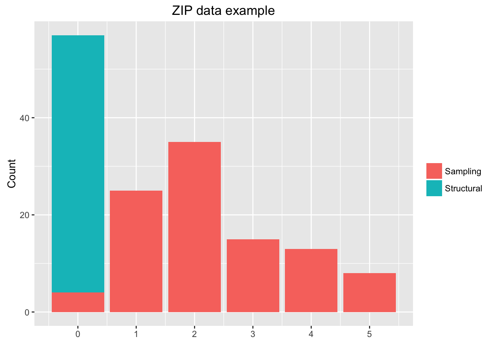

 

 
 
<!-- Final Project for Dr. Jeff Goldsmith's Course - [P8105 Data Science I](https://p8105.com)<right> </right>  -->
**See tutorial on the [Matlab version](https://zjph602xtc.github.io/ZIPFA/Matlab.html) or [R version](https://zjph602xtc.github.io/ZIPFA/R.html).**

Authors: 

Tianchen Xu$^{*}$, &nbsp;&nbsp; tx2155\@columbia.edu,  &nbsp;&nbsp; Department of Biostatistics, Mailman School of Public Health, Columbia University, NY 10032, USA   

Ryan T. Demmer, &nbsp;&nbsp; demm0009\@umn.edu,  &nbsp;&nbsp; Division of Epidemiology, School of Public Health, University of Minnesota, MN 55454, USA   

Gen Li, &nbsp;&nbsp; gl2521\@cumc.columbia.edu,   &nbsp;&nbsp; Department of Biostatistics, Mailman School of Public Health, Columbia University, NY 10032, USA

